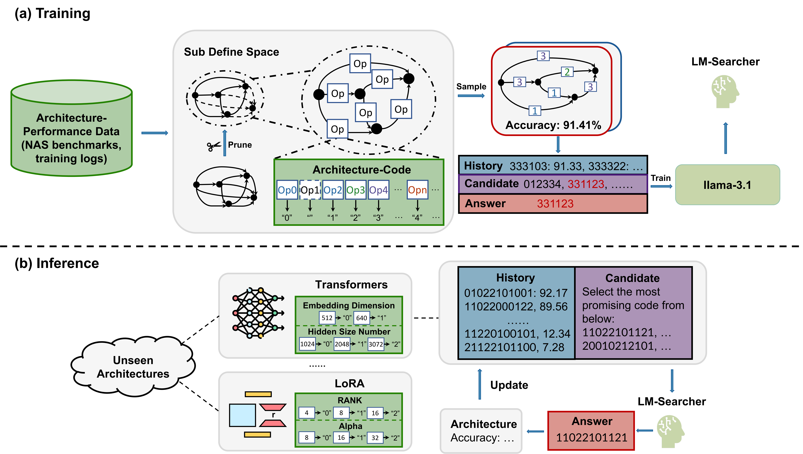

# LM-Searcher

This repo is for "LM-Searcher: Cross-domain Neural Architecture Search with LLMs via Unified Numerical Encoding"

### Datasets and Models

🤗 [LM-Searcher-Trajectory-228k Dataset](https://huggingface.co/datasets/Ashenone3/LM-Searcher-Trajectory-228K)

🤗 [LM-Searcher Checkpoint](https://huggingface.co/Ashenone3/LM-Searcher/tree/main)

## **Introduction**

Recent progress in Large Language Models (LLMs) has opened new avenues for solving complex optimization problems, including Neural Architecture Search (NAS). However, existing LLM-driven NAS approaches rely heavily on prompt engineering and domain-specific tuning, limiting their practicality and scalability across diverse tasks. 

In this work, we propose LM-Searcher, a novel framework that leverages LLMs for cross-domain neural architecture optimization without the need for extensive domain-specific adaptation. Central to our approach is NCode, a universal numerical string representation for neural architectures, which enables cross-domain architecture encoding and search. We also reformulate the NAS problem as a ranking task, training LLMs to select high-performing architectures from candidate pools using instruction-tuning samples derived from a novel pruning-based subspace sampling strategy. 

Our curated dataset, encompassing a wide range of architecture-performance pairs, encourages robust and transferable learning. Comprehensive experiments demonstrate that LM-Searcher achieves competitive performance in both in-domain (e.g., CNNs for image classification) and out-of-domain (e.g., LoRA configurations for segmentation and generation) tasks, establishing a new paradigm for flexible and generalizable LLM-based architecture search.

<br>
<div align="center">
  
</div>

## Training

We leverage [LLaMA-Factory](https://github.com/hiyouga/LLaMA-Factory) to train LM-Searcher. Below is the script we use for full fine-tuning on the LLaMA-3.1 model:
```shell
FORCE_TORCHRUN=1 llamafactory-cli train configs/llama3_full_sft_ds2.yaml
```

## Usage

### Deployment
We use [vllm](https://github.com/vllm-project/vllm) to deploy our LM-Searcher for inference.
After installing the dependencies required by vllm. You can deploy the model using `vllm_deploy.sh`:
```shell
vllm serve path-to-the-checkpoint --dtype auto --api-key token-abc123 --chat-template template.jinja
```

### Inference
A minimal example, `search.py`, is provided to show how LM-Searcher can be used to search for the optimal solution to a given problem：
```python
import os
import re
import json
import time
import random
import argparse

from decimal import Decimal
from openai import OpenAI

from utils import generate_random_cell, sample_new_cell

# -----------------------------
# Argument parser configuration
# -----------------------------
parser = argparse.ArgumentParser()
parser.add_argument('--output_dir', type=str, default='history', help="Directory to save search results.")
parser.add_argument('--chat_model', type=str, default='path-to-the-checkpoint', help="LLM model used for sampling new cells.")
parser.add_argument('--trial_num', type=int, default=192, help="Number of search trials to run.")
args = parser.parse_args()
print(args)

# -----------------------------
# Define the search space here
# (Customize according to your task)
# -----------------------------
search_space = [5, 5, 5, 5, 5, 5, 5, 5, 5, 5] # Search space with 5^10 solutions

performance_history = []
trial_dict = {}

# -----------------------------
# Create output directory if it doesn’t exist
# -----------------------------
if not os.path.exists(args.output_dir):
    os.makedirs(args.output_dir)

num_iters = 0
for iteration in range(num_iters, args.trial_num):
    # Control number of previous trials referenced by the model
    if iteration <= 200:
        output_num = iteration
    else:
        output_num = 200

    # First few trials are random
    if iteration <= 4:
        cell = generate_random_cell(search_space, trial_dict)
    # Later trials sample based on history
    else:
        cell = sample_new_cell(trial_dict, output_num, args.chat_model)
    
    # -----------------------------
    # Here the "reward function" is defined.
    # Replace this with your custom evaluation metric.
    # -----------------------------
    val_acc = random.uniform(0, 100)

    # Record results for the current trial
    trial_dict[f"Trial{iteration+1}"] = {}
    trial_dict[f"Trial{iteration+1}"]["cell"] = cell
    trial_dict[f"Trial{iteration+1}"]["prediction"] = val_acc

    # Save all historical results to file
    with open('{}/historical_results.json'.format(args.output_dir), 'w') as f:
        json.dump(trial_dict, f)
```